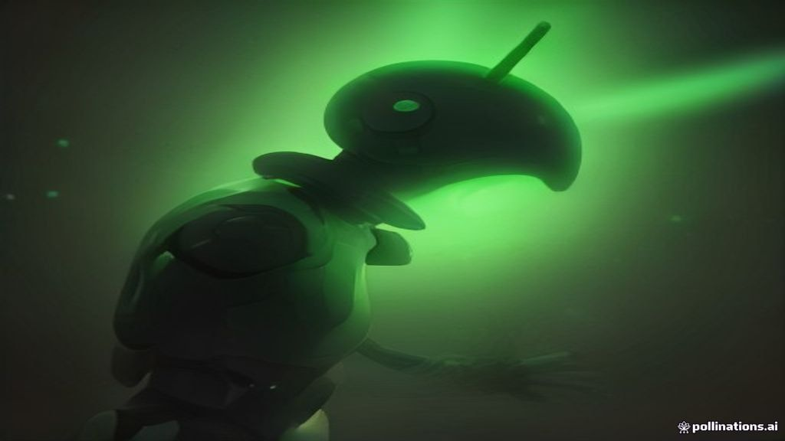
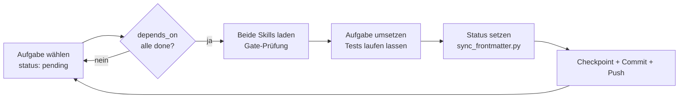
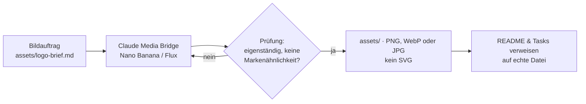

# Claudroide

<p align="center">
  
  <br>
  <b>Claudroide</b> — Eigenständiger mobiler KI-Coding-Assistent für Android
  <br>
  <sub>Native Touch-Bedienung · BYOK (Bring Your Own Key) · A56 5G optimiert · Privater GitHub Sync</sub>
</p>

<p align="center">
  <a href="README.md">🇺🇸 English</a> · <b>🇩🇪 Deutsch</b>
</p>

<p align="center">
  
  
  
  
  
  
</p>

<p align="center">
  
</p>

Claudroide ist eine eigenständige Android-App für KI-gestützte Projektarbeit (Claude-Code-artig, aber eigene Marke und eigener Code). Erstes Zielgerät: Samsung Galaxy A56 5G. Dieses Repository enthält die Spezifikation, 135 maschinenlesbare Bauaufgaben und die autonome Bau-Schleife.

> **Unabhängigkeitshinweis:** Claudroide ist ein unabhängiges Open-Source-Projekt und steht in keiner geschäftlichen oder offiziellen Verbindung zu Anthropic, PBC. Claude ist eine eingetragene Marke von Anthropic. Claudroide ermöglicht die Nutzung offizieller Entwickler-Schnittstellen auf Basis eigener API-Schlüssel (BYOK).

**Inhalt:** [Schnellstart](#schnellstart-in-claude-code) · [Wie der Bau abläuft](#wie-der-bau-abläuft) · [Status](#status) · [Bilder & Maskottchen](#bilder-und-maskottchen) · [Grenzen](#sicherheits--und-produktgrenzen) · [Dokumente](#alle-dokumente)

---

## Schnellstart in Claude Code

```bash
cd /home/mert/claudroide   # Projektordner öffnen
claude                      # Claude Code starten (CLAUDE.md wird automatisch geladen)
```

Dann in der Claude-Code-Eingabe:

| Eingabe | Wirkung |
|---|---|
| `/claudroide-resume` | Prüft den letzten Stand in `progress/BUILD-STATE.md` gegen die echten Dateien und baut genau dort weiter. |
| `Baue weiter bis zum finalen Produkt` | Startet die autonome Bau-Schleife aus `CLAUDE.md`: nächste freigegebene Aufgabe → umsetzen → testen → Checkpoint → Commit/Push → nächste Aufgabe. Anhalten tut Claude nur bei Sicherheitsgates, fehlenden Schlüsseln/Werten oder zweimal fehlgeschlagenen Tests. |
| `Baue Aufgabe 017` | Nur diese eine Aufgabe umsetzen. |

Voraussetzungen: `git` und die verifizierte private Remote `mertgoevse-wq/claudroide` (ist eingerichtet). Die sechs global installierten Skills (`swarm-planner`, `parallel-task`, `adaptive`, `android-profiler`, `android-permissions-security`, `testing-setup`) lädt Claude je Aufgabe selbst.

<details>
<summary><b>Nach einem Absturz (App, Termux, Gerät) wieder weitermachen</b></summary>

1. Gerät neu starten, Termux/Debian öffnen, in den Projektordner wechseln.
2. `claude` starten.
3. `/claudroide-resume` eingeben.

Der Skill vergleicht Checkpoint, Dateien und Git-Stand und ratet nicht. Deshalb ist es wichtig, dass jeder abgeschlossene Aufgabenblock vorher committed wurde — das macht die Bau-Schleife automatisch.
</details>

---

## Wie der Bau abläuft



- **Wellen statt Chaos:** `tasks/DEPENDENCIES.md` teilt die 135 Aufgaben in Wellen W0–W29. Unabhängige Aufgaben darf Claude parallel bauen (mit `/parallel-task`), eine leitende Sitzung führt zusammen.
- **Maschinenlesbare Aufgaben:** Jede Task-Datei trägt einen YAML-Kopf mit `status`, `depends_on`, `skills`, `wave`, `gate`. Das Skript [`tools/sync_frontmatter.py`](tools/sync_frontmatter.py) hält alle 135 Dateien, die Wellen und die Skill-Matrix synchron — handgepflegte Widersprüche sind damit ausgeschlossen.
- **Kein Stillstand nach Abbruch:** Nach jedem Block wird `progress/BUILD-STATE.md` aktualisiert und gepusht.

<details>
<summary><b>Befehle für die Repo-Pflege</b></summary>

```bash
python3 tools/sync_frontmatter.py --check            # Konsistenz prüfen (CI tut das auch)
python3 tools/sync_frontmatter.py                    # Abweichungen reparieren
python3 tools/sync_frontmatter.py --status 017=done  # Aufgabe 017 als erledigt markieren
```

`--status ID=done` gilt erst als verifiziert, wenn der Dateiinhalt danach unverändert bleibt (`done_since_last_edit`); eine spätere Änderung stuft die Aufgabe automatisch auf `in_progress` zurück.
</details>

---

## Status

Die Zählung unten kommt aus den Frontmatter-Köpfen und wird vom Sync-Skript geprüft.

| Bereich | Aufgaben | Stand |
|---|---|---|
| W0–W2 · Grundlagen, Machbarkeit, Geräteprüfung | 001–008 | 🟢 8 / 8 erledigt (W0–W2 abgeschlossen) |
| W3–W6 · App-Grundlage, Baupfade, Gestaltung | 009–024 | 🟢 16 / 16 erledigt (W3–W6 abgeschlossen) |
| W7–W9b · Oberfläche und Chat | 025–042 | 🟡 In Arbeit (13 / 18, W7+W8 abgeschlossen) |
| W10–W14 · Anbieter, Modelle, Datenschutz | 043–069 | ⬜ offen |
| W15–W19b · Agent und Projektzugriff | 070–094 | ⬜ offen |
| W20–W23 · Git und Befehle | 095–105 | ⬜ offen |
| W24–W26 · Sicherheitskern, Freigaben | 106–122 | ⬜ offen |
| W27–W29 · Skills, externe Tools, Abschluss | 123–135 | ⬜ offen |

<details>
<summary><b>Alle Wellen im Detail (W0–W29)</b></summary>

| Welle | Aufgaben | Vorgänger |
|---|---|---|
| W0 Einstieg | 001, 002, 003, 006 | — |
| W1 Machbarkeit | 004, 005, 009, 019 | 001, 002, 003 |
| W2 Geräte-/Bauprüfung | 007, 008 | 006 (+002) |
| W3 App-Grundlage | 010 | 009, 019 |
| W4 Baupfade | 011, 012 | 008 |
| W5 Einrichtung | 013–018 | 010 |
| W6 Gestaltung | 020–024 | 003, 019 |
| W7 UI-Grundlagen | 025–030 | 010, 023, 024 |
| W8 Chat | 031–035, 037, 042 | 025, 016 |
| W9 Chat-Laufzeit | 038, 039 | 031, 035 |
| W9b Streaming | 036 | 031, 035, 047, 052, 059 |
| W10 Anbietergrundlage | 043–045, 060 | 005, 016, 017 |
| W11 Anbieterhärtung | 046, 047, 052, 055–059 | 044, 045 |
| W12 Konkrete Anbieter | 048–051, 053, 054 | 004, 005, 047, 052, 059 |
| W13 Modell & Kontext | 061, 062, 065, 067 | 043, 055 |
| W13b Fallback | 063 | 062, 064, 065 |
| W13c Kostenanzeige | 041, 064 | 043, 055 (+061/+002) |
| W14 Offline/Daten | 066, 068, 069 | 039, 042, 062, 067 |
| W15 Agent-Grundlage | 070, 071 | 048–054 (+001) |
| W16 Agent-Ausführung | 040, 072–076, 078–080 | 070, 071 |
| W17 Agent-Erweiterung | 077 | 073, 078, 090, 099 |
| W18 Projektzugriff | 081, 082, 084, 087, 088, 092 | 010, 017 |
| W18b Projektanweisungen | 093 | 003, 122 |
| W19 Zugriffsfolgen | 083, 085, 086, 089, 091, 094 | 082 u. a. |
| W19b Dateiannahme | 090 | 088, 089, 119, 120 |
| W20 Git-Grundlage | 095, 098, 103 | 017, 045, 059 |
| W21 Git-Schreibpfad | 096, 097, 099, 100, 102, 104 | 095 u. a. |
| W22 Git-Upload | 101 | 095–100 |
| W23 Befehlsmachbarkeit | 105 | 007, 008, 010, 017 |
| W24 Sicherheitskern | 117–122, 125–127 | 017, 045 |
| W25 Befehle & Tests | 106, 107, 110–112, 114 | 105, 119, 120 |
| W26 Freigaben & Laufzeit | 108, 109, 113, 115, 116 | 017, 018, 105, 107 |
| W27 Skills | 123, 124, 129–131 | 001, 002, 017 |
| W28 Agents/externe Tools | 132–135 | 070, 117, 119, 122 |
| W29 Gesamttests | 128 | viele — startet zuletzt |

Maßgeblich sind die Einzeln-Abhängigkeiten in [`tasks/DEPENDENCIES.md`](tasks/DEPENDENCIES.md) und im Frontmatter jeder Datei, nicht diese Übersicht.
</details>

---

## Bilder und Maskottchen

Grafiken (Logo, App-Icon, Illustrationen, Banner) entstehen über die **Claude Media Bridge** des Nutzers. Regelkette, damit kein KI-Slop entsteht:



- **Maskottchen-Logo gerendert:** [`assets/claudroide-mascot-logo.jpg`](assets/claudroide-mascot-logo.jpg) (Grüner Android-Bot mit warm leuchtendem KI-Akzent).
- **Banner gerendert:** [`assets/claudroide-banner.jpg`](assets/claudroide-banner.jpg) (Grüner Android-Bot, der spielerisch an einem warm leuchtenden Terrakotta-KI-Funken knabbert).
- Kein SVG als fertiges Logo oder Illustration. Fertige Grafiken liegen ausschließlich als PNG, WebP oder JPG vor (geprüft durch CI `.github/workflows/repo-health.yml`).

---

## Sicherheits- und Produktgrenzen

- Eigener Name, eigene Bildsprache — keine Imitation von Claude, Anthropic oder bekannten Terminal-Maskottchen.
- Claude-Zugang in der App nur mit eigenem API-Schlüssel (BYOK). Kein Abo-Login, kein Token-Relay. OpenRouter, OpenCode, Antigravity (agy) und eigene Endpunkte nur auf offiziell dokumentierten Wegen.
- Schlüssel verschlüsselt auf dem Gerät, Geheimnis-Scan vor jedem Push, Push nur an dieses verifizierte private Repository.
- NPU-Beschleunigung, lokale KI und Bau direkt am A56 sind geprüfte Machbarkeitspunkte (Aufgaben 007, 011, 105) — keine zugesagten Funktionen, bis sie am echten Gerät belegt sind.

---

## Alle Dokumente

| Dokument | Inhalt |
|---|---|
| [`claudroide-spec.md`](claudroide-spec.md) | Hauptspezifikation: Produktziele, Grenzen, Prüfkriterien, 135 Aufgaben |
| [`tasks/`](tasks/) | 135 Aufgabendateien mit Frontmatter (`status`, `depends_on`, `skills`) |
| [`tasks/DEPENDENCIES.md`](tasks/DEPENDENCIES.md) | Wellen W0–W29, Sperrkanten, Parallel-Regeln |
| [`tasks/skill-matrix.md`](tasks/skill-matrix.md) | Zwei Skills pro Aufgabe, Quellen, Sicherheitsbefund |
| [`CLAUDE.md`](CLAUDE.md) | Regeln für Claude Code: Bau-Schleife, Skills, Medien, Repo-Pflege |
| [`tools/sync_frontmatter.py`](tools/sync_frontmatter.py) | Sync-Skript für Frontmatter und Status |
| [`progress/BUILD-STATE.md`](progress/BUILD-STATE.md) | Letzter verifizierter Arbeitsstand (Checkpoint) |
| [`.claude/skills/claudroide-resume/SKILL.md`](.claude/skills/claudroide-resume/SKILL.md) | `/claudroide-resume` nach Abbruch |
| [`assets/logo-brief.md`](assets/logo-brief.md) | Bildauftrag für die Media Bridge |
| [`.github/workflows/repo-health.yml`](.github/workflows/repo-health.yml) | CI: prüft Aufgabenzahl und Frontmatter-Konsistenz |
