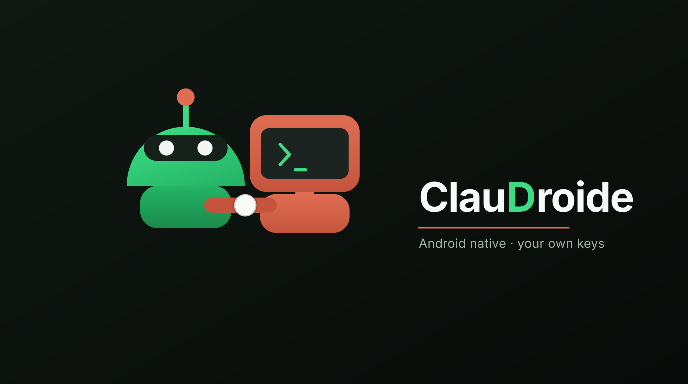
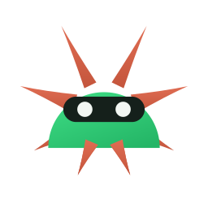
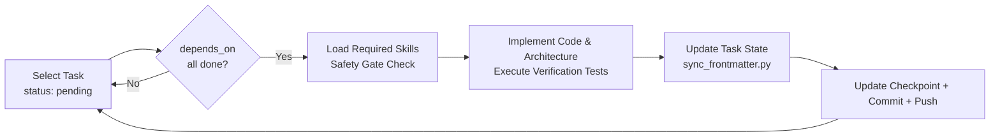
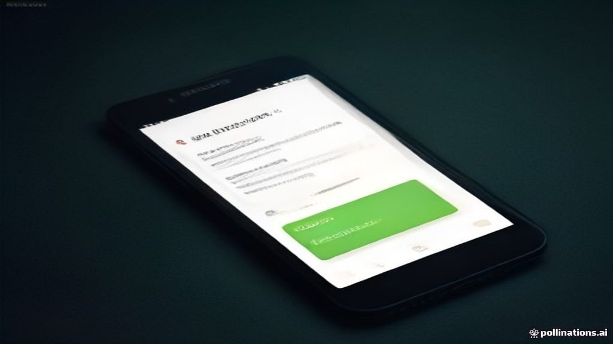
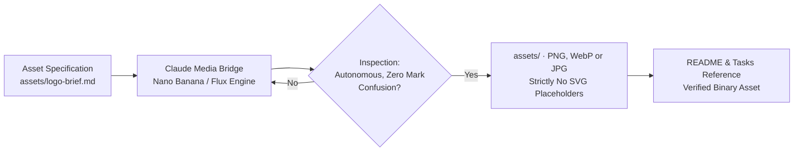

# ClauDroide

<p align="center">
  
</p>

<p align="center">
  
  <br>
  <b>ClauDroide</b> — Autonomous Mobile AI Coding Assistant for Android
  <br>
  <sub>Native Touch Interface · BYOK (Bring Your Own Key) · Samsung Galaxy A56 5G Tuned · Private GitHub Sync</sub>
</p>

<p align="center">
  <b>🇺🇸 English</b> · <a href="README.de.md">🇩🇪 Deutsch</a>
</p>

<p align="center">
  
  
  
  
  
  
</p>

ClauDroide is an independent native Android application for AI-assisted software engineering and project management (inspired by the Claude Code CLI paradigm, but with an independent brand, clean-room architecture, and mobile-native Compose UI). Primary hardware benchmark: Samsung Galaxy A56 5G. This repository contains the complete specification, 135 machine-readable task briefs, and the deterministic autonomous engineering loop.

> **Independence Notice:** ClauDroide is an independent open-source project and is not commercially or officially affiliated with Anthropic, PBC. Claude is a registered trademark of Anthropic. ClauDroide interacts exclusively via official developer APIs with user-provided API keys (BYOK).

**Navigation:** [Quickstart](#quickstart-in-claude-code) · [Engineering Loop](#how-the-autonomous-loop-works) · [Progress Status](#progress-status) · [Assets & Mascot](#assets-and-visual-identity) · [Security Guardrails](#security-and-product-guardrails) · [Documentation Index](#complete-documentation-index)

---

## Quickstart in Claude Code

```bash
cd /home/mert/claudroide   # Navigate to project root
claude                      # Launch Claude Code (CLAUDE.md loads automatically)
```

Within Claude Code REPL:

| Command / Prompt | Action |
|---|---|
| `/claudroide-resume` | Inspects latest checkpoint in `progress/BUILD-STATE.md` against filesystem reality and resumes engineering seamlessly. |
| `Baue weiter bis zum finalen Produkt` | Starts the autonomous engineering loop from `CLAUDE.md`: select earliest pending task with fulfilled dependencies → implement → test → checkpoint → commit & push. Pauses only on safety gates or blockers. |
| `Baue Aufgabe 017` | Implements a single specific task in isolation. |

Prerequisites: `git` and verified private remote `mertgoevse-wq/claudroide`. The six globally installed skills (`swarm-planner`, `parallel-task`, `adaptive`, `android-profiler`, `android-permissions-security`, `testing-setup`) are verified and loaded per task.

<details>
<summary><b>Resuming Work After an Interruption or Crash</b></summary>

1. Restart device / Termux environment and enter `/home/mert/claudroide`.
2. Launch `claude`.
3. Type `/claudroide-resume`.

The skill cross-examines the checkpoint, working tree, and Git commit log without speculating. Every finished task is verified, committed, and synced to remote.
</details>

---

## How the Autonomous Loop Works



- **Waves Instead of Chaos:** `tasks/DEPENDENCIES.md` segments all 135 tasks into dependency waves W0–W29. Non-overlapping tasks can run concurrently via `/parallel-task`.
- **Machine-Readable Task Definitions:** Every task in `tasks/` carries strict YAML frontmatter (`status`, `depends_on`, `skills`, `wave`, `gate`). The single source of truth is maintained by [`tools/sync_frontmatter.py`](tools/sync_frontmatter.py).
- **Resilient Checkpoints:** `progress/BUILD-STATE.md` records verified IDs, test evidence, modified files, and clean Git commits after every task.

<details>
<summary><b>Repository Maintenance Commands</b></summary>

```bash
python3 tools/sync_frontmatter.py --check            # Verify consistency across 135 tasks (enforced in CI)
python3 tools/sync_frontmatter.py                    # Heal discrepancies and hashes
python3 tools/sync_frontmatter.py --status 025=done  # Mark task 025 as completed
```

Marking `--status ID=done` requires the task specification to remain untouched (`done_since_last_edit: true`); any subsequent modification immediately triggers review.
</details>

---

## Progress Status

Verified counts synced directly from YAML frontmatter:

| Domain | Tasks | Status |
|---|---|---|
| W0–W2 · Foundations, Feasibility, Hardware Profile | 001–008 | 🟢 8 / 8 Completed (W0–W2 Closed) |
| W3–W6 · Core Architecture, Build Pipelines, Design Tokens | 009–024 | 🟢 16 / 16 Completed (W3–W6 Closed) |
| W7–W9b · Compose UI & Interactive Chat | 025–042 | 🟢 18 / 18 Completed (W7–W9b Closed) |
| W10–W14 · Model Providers, Routing & Privacy | 043–069 | 🟢 27 / 27 Completed (W10–W14 Closed) |
| W15–W19b · Agent Execution & Project Context (SAF) | 070–094 | 🟢 25 / 25 Completed (W15–W19b Closed) |
| W20–W23 · Git Integration & Sandbox Execution | 095–105 | 🟢 11 / 11 Completed (W20–W23 Closed) |
| W24–W26 · Security Engine, Approvals & Token Vault | 106–122 | 🟢 17 / 17 Completed (W24–W26 Closed) |
| W27–W29 · Dynamic Skills, External Tooling & Full E2E | 123–135 | 🟢 13 / 13 Completed (W27–W29 Closed) |

<details>
<summary><b>Complete Wave Architecture (W0–W29)</b></summary>

| Wave | Tasks | Dependencies |
|---|---|---|
| W0 Bootstrap | 001, 002, 003, 006 | — |
| W1 Feasibility | 004, 005, 009, 019 | 001, 002, 003 |
| W2 Hardware Benchmarks | 007, 008 | 006 (+002) |
| W3 Application Base | 010 | 009, 019 |
| W4 Build Pipelines | 011, 012 | 008 |
| W5 Setup & Lifecycle | 013–018 | 010 |
| W6 Design System | 020–024 | 003, 019 |
| W7 UI Foundation | 025–030 | 010, 023, 024 |
| W8 Chat Engine | 031–035, 037, 042 | 025, 016 |
| W9 Execution Runtime | 038, 039 | 031, 035 |
| W9b SSE Streaming | 036 | 031, 035, 047, 052, 059 |
| W10 Provider Foundations | 043–045, 060 | 005, 016, 017 |
| W11 Provider Hardening | 046, 047, 052, 055–059 | 044, 045 |
| W12 Concrete Providers | 048–051, 053, 054 | 004, 005, 047, 052, 059 |
| W13 Context Management | 061, 062, 065, 067 | 043, 055 |
| W13b Model Fallbacks | 063 | 062, 064, 065 |
| W13c Token Cost Tracking | 041, 064 | 043, 055 (+061/+002) |
| W14 Offline Resilience | 066, 068, 069 | 039, 042, 062, 067 |
| W15 Agent Foundation | 070, 071 | 048–054 (+001) |
| W16 Agent Dispatcher | 040, 072–076, 078–080 | 070, 071 |
| W17 Parallel Orchestration | 077 | 073, 078, 090, 099 |
| W18 Storage Access Framework (SAF) | 081, 082, 084, 087, 088, 092 | 010, 017 |
| W18b Project Instructions | 093 | 003, 122 |
| W19 Access Enforcement | 083, 085, 086, 089, 091, 094 | 082 etc. |
| W19b File Staging & Diffing | 090 | 088, 089, 119, 120 |
| W20 Git Core | 095, 098, 103 | 017, 045, 059 |
| W21 Git Staging & Trees | 096, 097, 099, 100, 102, 104 | 095 etc. |
| W22 Secure Push & Sync | 101 | 095–100 |
| W23 Execution Sandboxing | 105 | 007, 008, 010, 017 |
| W24 Security Kernel | 117–122, 125–127 | 017, 045 |
| W25 Command Validation | 106, 107, 110–112, 114 | 105, 119, 120 |
| W26 Approval Engine & Foreground Service | 108, 109, 113, 115, 116 | 017, 018, 105, 107 |
| W27 Dynamic Skills Engine | 123, 124, 129–131 | 001, 002, 017 |
| W28 MCP & External Integrations | 132–135 | 070, 117, 119, 122 |
| W29 End-to-End Suite | 128 | Comprehensive validation |
</details>

---

## Interface & Native Mobile Experience

<p align="center">
  
</p>

ClauDroide delivers a native touch-first developer experience built with Jetpack Compose & Material 3:
- **Interactive Chat & Terminal:** Real-time streaming assistant, syntax-highlighted code diff blocks, local shell tool output, and cancellation controls.
- **Project Workspaces (SAF):** Storage Access Framework integration with scoped directory trees, persistent URI permissions, and zero root requirements.
- **BYOK Privacy Vault:** Hardware-backed API key storage with Android Keystore encryption for Claude API, OpenRouter, and custom endpoints.
- **Autonomous Subagent & Safety Gates:** Built-in verification gates for Git commits, pushes, and destructive operations with clear manual approval.

---

## Assets and Visual Identity

Visual assets (logo, adaptive app icon, state illustrations, responsive banners) are crafted via the user's **Claude Media Bridge** following strict brand separation guidelines:



- **Mark:** [`assets/brand/mark-1024.png`](assets/brand/mark-1024.png), with `-256` and `-96` variants. Also generated straight into the app as the adaptive launcher icon (`app/src/main/res/mipmap-*/ic_launcher_foreground.png`, plus a `monochrome` layer for Android 13+ themed icons).
- **Banner:** [`assets/brand/banner.png`](assets/brand/banner.png) — 1376x768, 16:9. The wordmark is real Inter, so the product name is spelled correctly by construction.
- **In the app:** both ship as WebP derived from those PNG sources — `res/drawable-nodpi/claudroide_mark.webp` (13 KB) and `claudroide_banner.webp` (15 KB, down from 112 KB). The PNGs stay in the repo as the lossless source; the 50 KB cap applies to what goes on the device, and `BrandAssetContractTest` enforces it per shipped file.
- **Design:** an Android dome in `#3DDC84` wearing a Claude-grammar burst as its crown. The two rays at ±26° are the droid's antennae **and** two rays of the burst — the same strokes serve both systems, so neither half can be deleted without breaking the other. That is the "no subordinate symbol" requirement expressed as geometry rather than as a caption.
- Drawn as exact vector geometry by [`tools/brand.py`](tools/brand.py), not by an image model: the wordmark has to spell "ClauDroide", and diffusion models misspell wordmarks. The banner and the launcher icon import the same geometry, so they cannot drift apart.
- Binary integrity enforced by CI: no SVG permitted in `assets/` (`.github/workflows/repo-health.yml`). The SVGs under `assets/brand/.build/` are build input, not shipped assets. Source files under `assets/brand/` are uncapped; the per-image 50 KB cap applies to shipped app resources and is test-enforced.

---

## Security and Product Guardrails

- **Distinct Brand Identity:** Clean-room naming and visual identity; zero trademark confusion with Anthropic, Claude, or third-party mascots.
- **Strict BYOK (Bring Your Own Key):** Zero web-scraping, zero session sharing, zero unauthorized proxying. Only official developer endpoints with user-held credentials.
- **Hardware-Backed Encryption:** Tokens stored securely in Android Keystore / EncryptedSharedPreferences; secret scanning enforced prior to commit/push.
- **Data Minimization:** No telemetry leakage, strictly scoped Storage Access Framework (SAF) trees, no unnecessary `MANAGE_EXTERNAL_STORAGE` requests.

---

## Complete Documentation Index

| Document | Purpose |
|---|---|
| [`claudroide-spec.md`](claudroide-spec.md) | Product specification, architecture guidelines, test criteria, and all 135 tasks |
| [`README.de.md`](README.de.md) | Deutsche Version der Dokumentation |
| [`tasks/`](tasks/) | 135 individual task specifications with structured YAML metadata |
| [`tasks/DEPENDENCIES.md`](tasks/DEPENDENCIES.md) | Graph dependencies across waves W0–W29 |
| [`tasks/skill-matrix.md`](tasks/skill-matrix.md) | Two skills assigned per task, provenance, and audit status |
| [`CLAUDE.md`](CLAUDE.md) | Autonomous engineering guidelines, media rules, and Git discipline |
| [`tools/sync_frontmatter.py`](tools/sync_frontmatter.py) | Synchronization engine for task frontmatter and verification |
| [`progress/BUILD-STATE.md`](progress/BUILD-STATE.md) | Resilient verified checkpoint ledger |
| [`.claude/skills/claudroide-resume/SKILL.md`](.claude/skills/claudroide-resume/SKILL.md) | Interruption recovery skill |
| [`assets/logo-brief.md`](assets/logo-brief.md) | Visual asset specifications and generation briefs |
| [`.github/workflows/repo-health.yml`](.github/workflows/repo-health.yml) | GitHub Actions CI verifying task consistency and asset integrity |
| [`.github/workflows/build-apk.yml`](.github/workflows/build-apk.yml) | Android APK compilation workflow on GitHub Actions |
